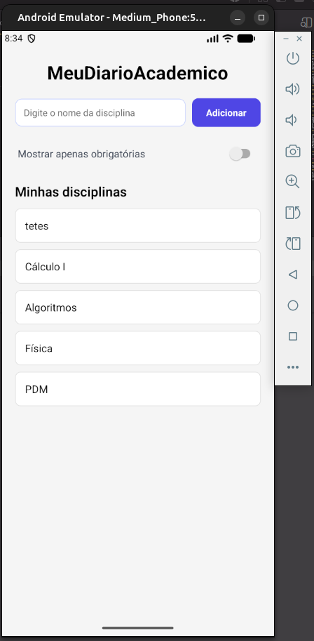

# MeuDiarioAcademico

Aplicativo desenvolvido com Expo e React Native para registrar disciplinas do semestre em uma interface simples e organizada.

## 1. Objetivo

Consolidar os fundamentos de interface em React Native, incluindo:

- criação de projeto Expo
- uso de componentes nativos
- import/export de constantes
- uso de `StyleSheet.create`
- organização com Flexbox
- estrutura de código em arquivos separados

## 2. Descrição do app

O app apresenta uma tela inicial para cadastro rápido de disciplinas, com:

- cabeçalho com título do app
- campo para inserir o nome da disciplina
- botão para adicionar
- lista de disciplinas abaixo do formulário
- opção extra de filtro visual com `Switch`

## 3. Comando para criar o projeto

```bash
npx create-expo-app@latest MeuDiarioAcademico --template blank
```

## 4. Como executar

```bash
cd MeuDiarioAcademico
npx expo start
```

Depois, abra o projeto no emulador Android ou no Expo Go.

## 5. Dependências utilizadas

```bash
npx expo install react-native-safe-area-context
```

## 6. Funcionalidades implementadas

- SafeAreaView com área segura da tela
- TextInput para cadastro da disciplina
- botão de adição com visual em `Pressable`
- lista de disciplinas em formato visual organizado
- uso de `flex` e largura percentual (`%`)
- arquivo `labels.js` para manter rótulos em um local centralizado
- estilos organizados no `StyleSheet.create`
- switch opcional para filtrar visualmente disciplinas obrigatórias

## 7. Estrutura do projeto

```txt
MeuDiarioAcademico/
├─ App.js
├─ labels.js
├─ app.json
├─ index.js
├─ package.json
├─ assets/
├─ .gitignore
├─ README.md
└─ node_modules/
```

## 8. Prints da tela

Adicione aqui os prints gerados no emulador ou no Expo Go.

```md

```

## 9. Observações

A interface foi organizada com `flexDirection: 'row'`, `justifyContent` e `alignItems` para manter o formulário alinhado e visualmente equilibrado. Esse uso de Flexbox permite que o input e o botão fiquem em uma linha harmoniosa, enquanto a lista abaixo permanece organizada e legível.

## 10. Entrega

- Projeto desenvolvido em Expo
- README com instruções e prints
- estrutura de código organizada
- requisitos da atividade atendidos

> O arquivo `node_modules` não deve ser enviado no repositório final.
