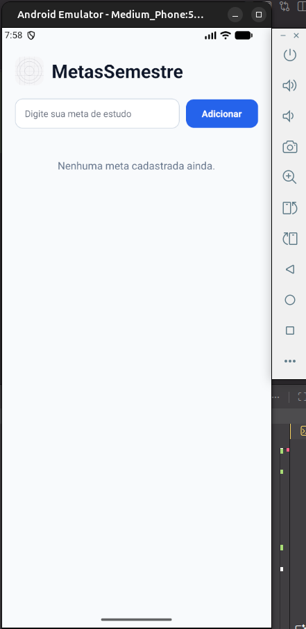
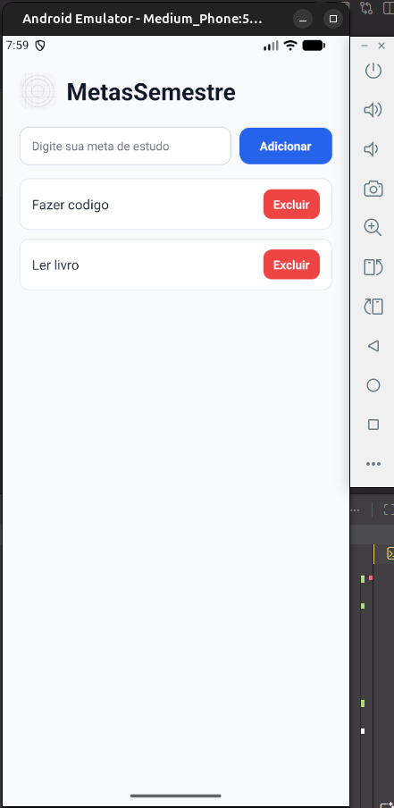

# MetasSemestre

Aplicativo desenvolvido com Expo e React Native para registrar metas acadêmicas do semestre, com persistência local entre sessões.

## 🎯 Objetivo

Aplicar os conceitos de:

- `useState` para controlar texto e lista de metas
- `useEffect` para carregar e salvar dados
- `Pressable` para interação com o usuário
- componentização com arquivos separados
- `FlatList` para renderizar listas dinamicamente
- `AsyncStorage` para persistência local

## 📱 Descrição do app

A aplicação permite que o aluno:

- cadastre uma meta de estudo
- remova metas já concluídas ou não desejadas
- veja a lista organizada na tela
- mantenha os dados salvos ao fechar e reabrir o app

## 🛠️ Comandos utilizados

```bash
npx create-expo-app@latest MetasSemestre --template blank
cd MetasSemestre
npx expo install @react-native-async-storage/async-storage react-native-safe-area-context
npx expo start
```

## ▶️ Como executar

```bash
cd MetasSemestre
npx expo start
```

Depois, abra o projeto no emulador Android ou no Expo Go.

## ✅ Funcionalidades implementadas

- cadastro de metas com input e botão
- validação para impedir texto vazio
- remoção de itens da lista
- persistência local com `AsyncStorage`
- uso de `FlatList` para melhor desempenho
- cabeçalho com imagem local e título da aplicação
- organização em componentes: `MetaInput` e `MetaList`

## 📁 Estrutura do projeto

```txt
MetasSemestre/
├─ App.js
├─ app.json
├─ index.js
├─ package.json
├─ assets/
│  ├─ icon.png
│  ├─ print1.png
│  ├─ print2.png
│  └─ print3.png
├─ components/
│  ├─ MetaInput.js
│  └─ MetaList.js
├─ README.md
└─ node_modules/
```

## 🔄 Explicação do `useEffect`

O projeto utiliza dois `useEffect`:

1. `useEffect` de carregamento:
   - executa na montagem do app
   - lê os dados salvos em `AsyncStorage`
   - repopula a lista com as metas anteriores

2. `useEffect` de salvamento:
   - executa sempre que a lista `metas` muda
   - salva o array em JSON usando `AsyncStorage.setItem`

Essa combinação garante que as metas permaneçam salvas mesmo após o app ser fechado.

## 🖼️ Prints da tela

### Tela inicial



### Tela com metas adicionadas



### Tela após reabrir o app


## 📌 Observação

Os arquivos de imagem já estão presentes na pasta de assets e são referenciados corretamente no README para visualização no GitHub.

> O diretório `node_modules` não deve ser enviado no repositório final.
